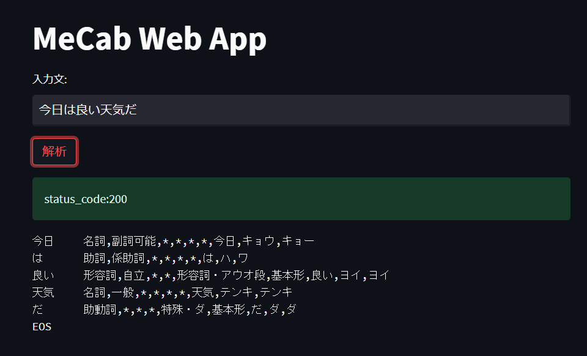

# MeCab Web App based on FastAPI and Streamlit
This repository provides a simple web app which analyze Japanese text by MeCab.
<div align="left"></div>

## Requirements
Python 3.8 (I recommend using a package management tool such as Anaconda.)

## Install
At first, you need to setup MeCab.
```
$ apt install mecab libmecab-dev mecab-ipadic-utf8
$ ln -s /etc/mecabrc /usr/local/etc/mecabrc
```

Additionally, you need to install some python modules.
```
$ pip install "fastapi[all]" streamlit mecab-python3
```

## How to run

```
$ uvicorn main:app --reload
$ streamlit run app.py
```

And then, open `http://localhost:8501/` by your browser.
